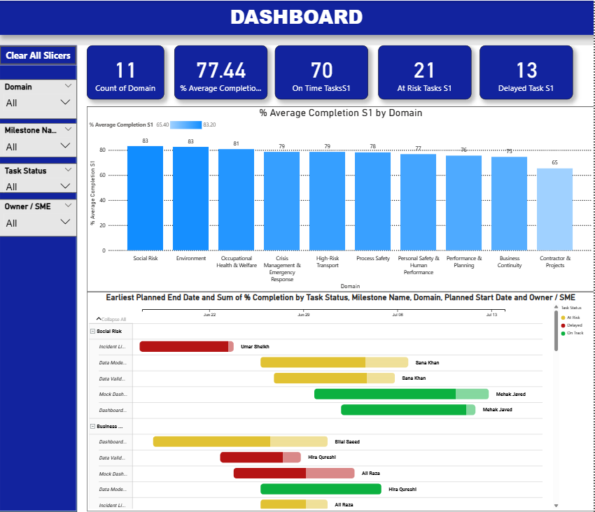
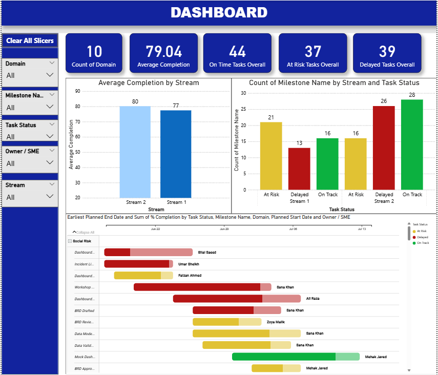

# HSE Strategic Projects Dashboard

📍 **Purpose**  
An enterprise-grade Power BI dashboard built to track the progress of two key HSE (Health, Safety & Environment) streams:  
**Stream 1 - Incident Data Mart**  
**Stream 2 - HSE Risk Domain Dashboards**

---

### 🚀 Highlights
- **Milestone Tracking** with real-time status updates
- **Delay Identification** with visual flags and bucket categories
- **SME Follow-Up Indicators** to highlight overdue or blocked tasks
- **Leadership Summary** for high-level project overviews
- Slicers for:
  - Stream
  - Milestone Stage
  - Domain
  - Task Status
  - SME

---

### 🛠️ Tools & Tech Stack
- Power BI (DAX, Power Query)
- Excel (for data entry)
- SharePoint (embed ready)
- Clean UI/UX using minimalist layout & strict design standards

---

### 📷 Preview

**🔹 Milestone Tracking**

**🔹 Stream Comparison**

---

### 📁 Files Included
- `hse_projects_dashboard.pbix` (mock version)
- Mock data file in Excel
- Screenshots of the dashboard
- Full documentation

---

> ✅ Developed under team lead guidance for internal performance reviews, milestone tracking, and HSE strategic planning.
> 🔗 SharePoint embedding supported.

---

### 🧾 License
MIT License or “No License” if it's a portfolio-only showcase.
